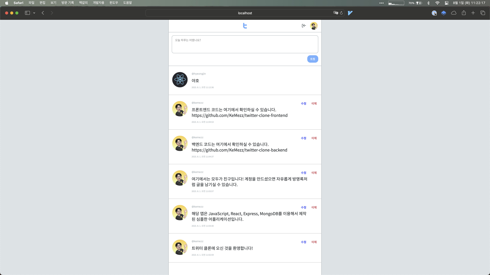

  

<h1 align="center">
  심플 트위터 클론 (프론트엔드)
</h1>

  

## 👻 소개

심플한 트위터 클론 프로젝트입니다. 간단한 백엔드 기술을 사용하여 계정을 만들고, 트윗에 대한 CRUD 상호작용이 가능합니다.

## 🔧 주요 기술

- JavaScript
- React
- react-router-dom
- styled-components
- recoil
- axios

## 🚀 배포

Github Pages로 배포 예정
